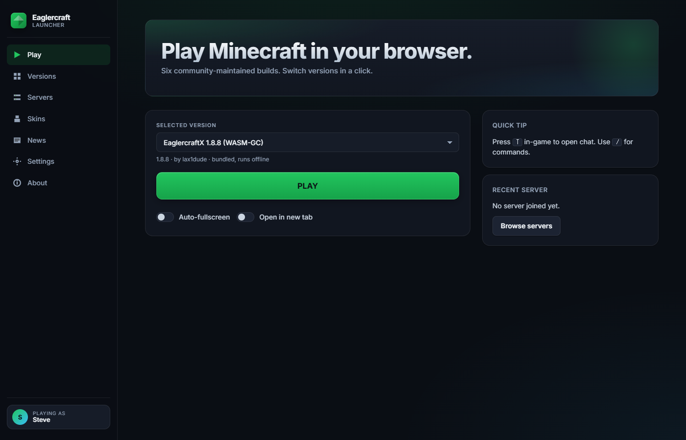
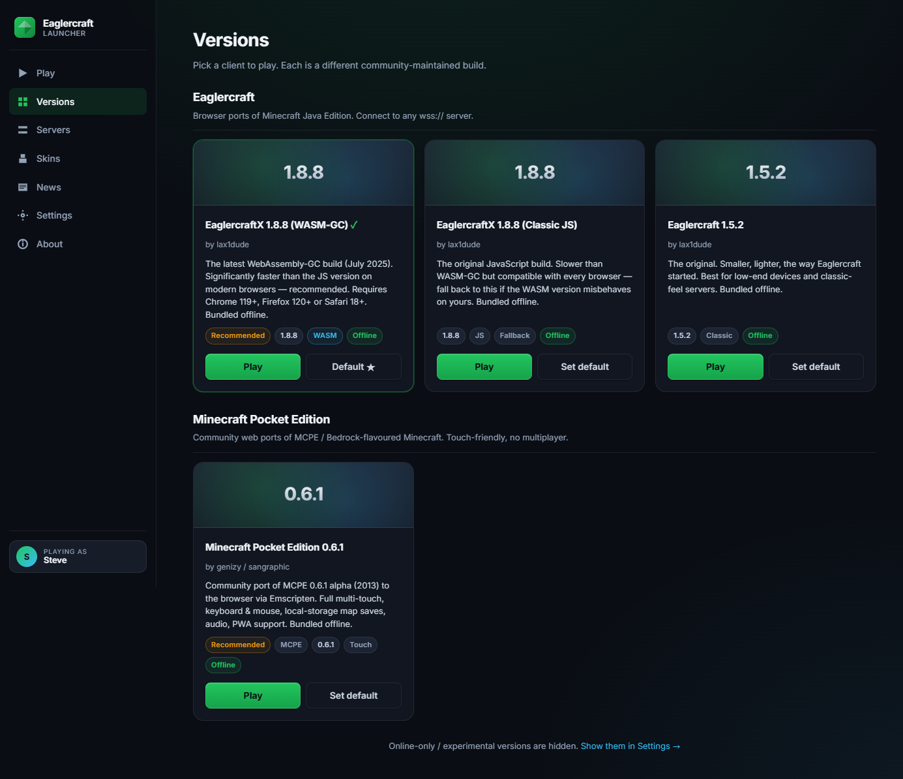
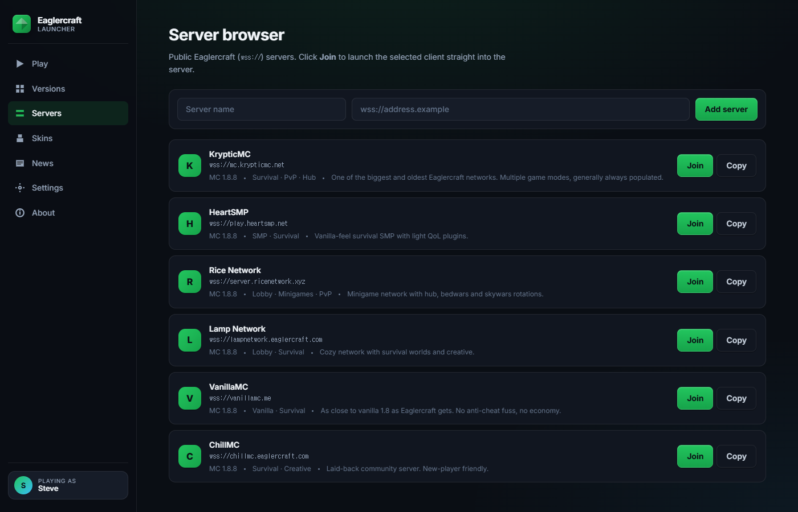
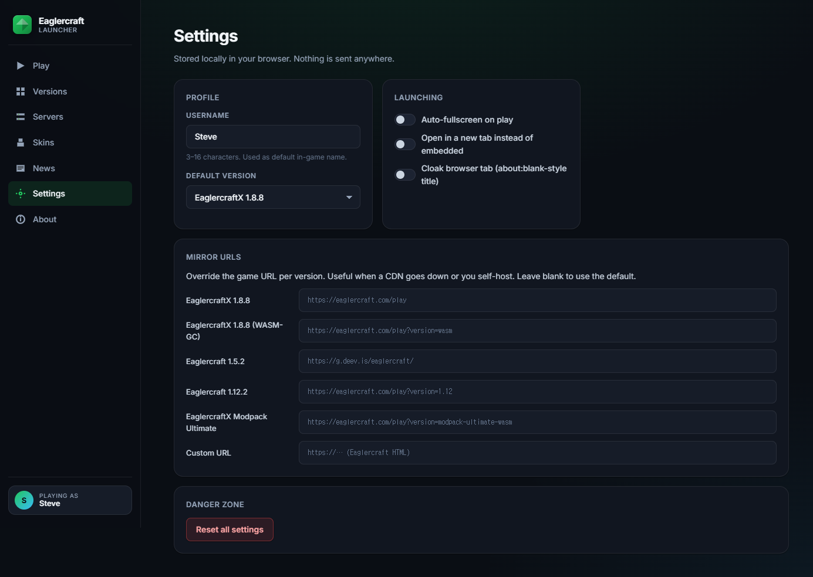
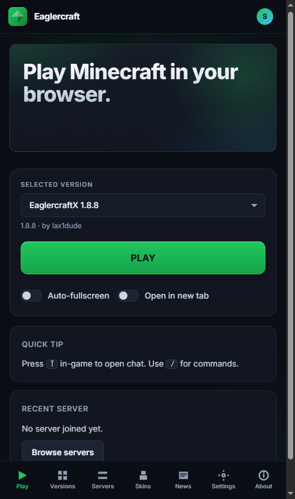
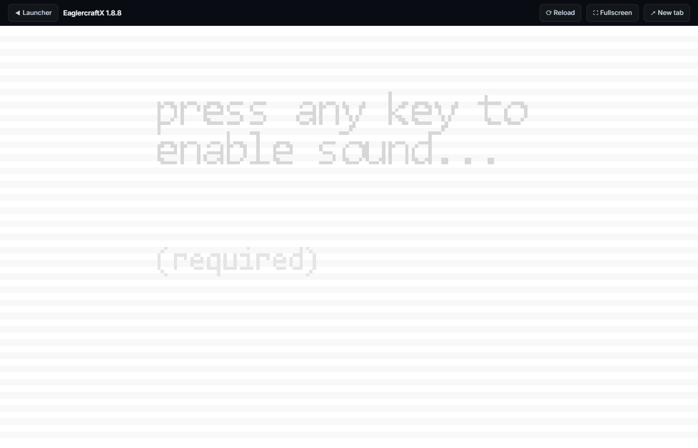
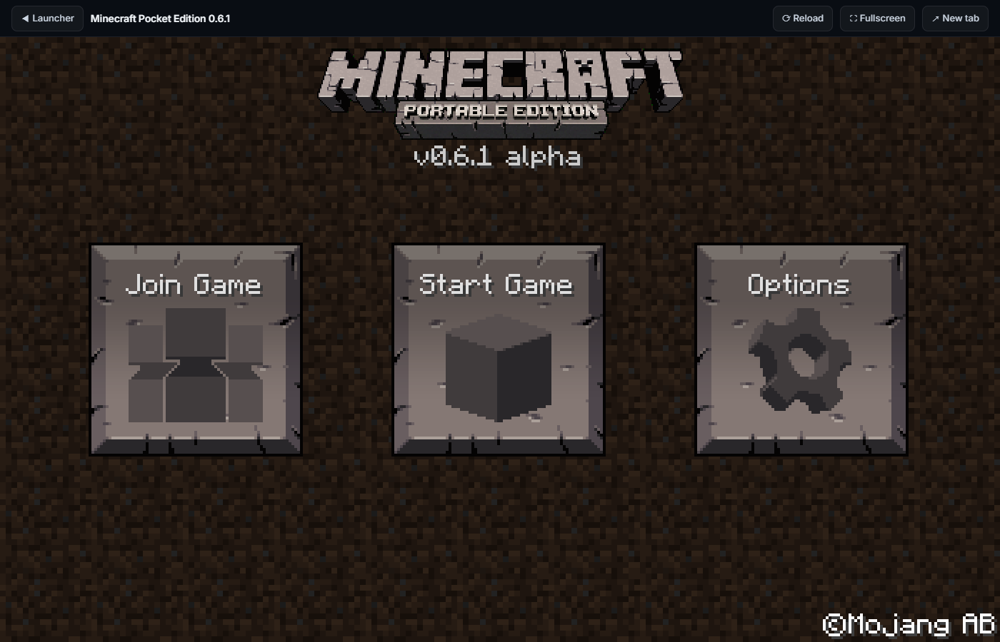

<div align="center">

# Minecraft Archive Experimental

**A modern, self-hosted launcher for browser-playable Minecraft ports.**
One UI for EaglercraftX (1.8.8 WASM-GC + Classic JS), Eaglercraft 1.5.2, and Minecraft Pocket Edition 0.6.1 — bundled, mobile-friendly, and zero external dependencies once loaded.

[](https://minecraft-archive-experimental.pages.dev)
[](https://pages.cloudflare.com/)
[](https://github.com/j0shua-SYSON/Minecraft-Archive-Experimental-Web/commits/main)
[](https://github.com/j0shua-SYSON/Minecraft-Archive-Experimental-Web)
[](https://github.com/j0shua-SYSON/Minecraft-Archive-Experimental-Web/stargazers)

<a href="https://minecraft-archive-experimental.pages.dev"></a>

</div>

---

## Why this exists

The community-port Minecraft scene is fragmented. There are at least a dozen mirrors of EaglercraftX, two competing builds (JS and WASM-GC), separate hosts for 1.5.2 and 1.12.2, and a smattering of MCPE web ports — all on different domains, with different UIs, with different sets of public servers, and with at least one or two of them broken at any given time because a CDN moved.

This project consolidates the ones that matter into a **single, clean launcher** that:

- **bundles the game files locally** (no `eaglercraft.com` CORS surprises, works offline after first load),
- **groups builds by edition** (Java-Edition ports / Pocket-Edition ports),
- **has a server browser** with curated public servers + add-your-own,
- **stores everything in `localStorage`** — no accounts, no telemetry, no analytics.

It's a static site. Drop it on Cloudflare Pages, GitHub Pages, Netlify, or just double-click `index.html`.

---

## Quick start

| You want to… | Do this |
| --- | --- |
| **Just play** | Open **[minecraft-archive-experimental.pages.dev](https://minecraft-archive-experimental.pages.dev)** in any modern browser. |
| **Play offline / on a school machine** | Clone the repo, open `index.html` directly — everything except the optional online versions works from `file://`. |
| **Host your own instance** | `wrangler pages deploy . --project-name=<yours>` (or push to GitHub Pages, Netlify, Vercel — it's all static). |

> **Browser requirements.** The default version is the WASM-GC build, which needs Chrome 119+, Firefox 120+ or Safari 18+. The Classic JS fallback works on anything that runs WebGL.

---

## Features

### Game catalog

- **6 versions across 2 categories**, grouped on the Versions tab.
- **One-click default** — set any version as the default; the big PLAY button on the home view uses it.
- **Per-version mirror URLs** — every entry has an editable override in Settings, so if a CDN goes dark you can repoint to a working mirror without forking the code.
- **Experimental versions hidden by default** — online-only builds (1.12.2, Modpack Ultimate) live behind a Settings toggle with a clear warning that they probably won't embed because of the upstream's frame-blocking headers.

### Server browser

- **6 curated public Eaglercraft (`wss://`) servers** preloaded (Kryptic, HeartSMP, Rice Network, Lamp, VanillaMC, ChillMC), each with version + game modes + a one-line blurb.
- **Add custom servers** with `wss://` URL validation.
- **One-click Join** — passes `?joinServer=` to clients that support direct-connect, otherwise copy-paste the address into the in-game multiplayer menu (Copy button included).
- Recent server displayed on the home view.

### Modern UI

- Clean **Inter typography**, soft shadows, rounded corners, modern green accent — no pixel-art Minecraft aesthetic.
- **Glassmorphism sidebar** on desktop.
- **Mobile bottom-nav** with safe-area insets, ≥44 px touch targets, single-column stacks. The whole launcher reflows for phones; there's no horizontal scroll.
- Splash text auto-rotates (subtle, no Comic Sans).
- Custom pill toggles, accessible focus rings, `prefers-reduced-motion` respected.

### Privacy

- **No analytics.** No Google Analytics, no Cloudflare Web Analytics, no pixels.
- **No external HTTP calls** while playing — once the game HTML is loaded, the iframe is talking to the multiplayer server you chose (or nothing at all, for singleplayer).
- **No accounts.** Username is whatever you type into Settings; it's stored only in your browser's `localStorage`.
- **No IP collection, no event log.** (A telemetry panel was prototyped and then removed at the request of the author.)

---

## What's bundled

All four headline builds ship inside the repo. Same-origin iframing means no CDN can break the launcher.

| Slug | Display name | MC version | Build | Source | Bundle size |
| --- | --- | --- | --- | --- | --- |
| `eaglercraftx-1.8.8` | EaglercraftX 1.8.8 (WASM-GC) | 1.8.8 | WebAssembly-GC, Jul 2025 build | [`lax1dude`](https://eaglercraft.com) (via IPFS) | 15 MB |
| `eaglercraftx-1.8.8-js` | EaglercraftX 1.8.8 (Classic JS) | 1.8.8 | JavaScript (TeaVM) | [`op-max/EaglercraftX-1.8.9`](https://github.com/op-max/EaglercraftX-1.8.9) | 17 MB |
| `eaglercraft-1.5.2` | Eaglercraft 1.5.2 | 1.5.2 | JavaScript (TeaVM) | [`lDEVinux/eaglercraft`](https://github.com/lDEVinux/eaglercraft) | 17 MB |
| `mcpe-0.6.1` | Minecraft Pocket Edition 0.6.1 | 0.6.1 alpha | Emscripten (WASM + asset bundle) | [`genizy/mcpeweb`](https://github.com/genizy/mcpeweb) via `sangraphic.github.io/MCPEweb/` | 13 MB |

Plus three online entries hidden behind **Settings → Experimental versions**:

| Slug | Display name | MC version | Hosted at |
| --- | --- | --- | --- |
| `eaglercraft-1.12.2` | Eaglercraft 1.12.2 (Online) | 1.12.2 | `eaglercraft.com/play?version=1.12` |
| `eaglercraft-modpack` | EaglercraftX Modpack Ultimate (Online) | 1.8.8 + Ultimate pack | `eaglercraft.com/play?version=modpack-ultimate-wasm` |
| `custom` | Custom URL | any | Settings → Mirror URLs |

The online entries will probably *not* iframe on most browsers because of `eaglercraft.com`'s `X-Frame-Options` — the launcher warns about this and recommends toggling **Open in new tab**.

---

## Screenshots

<table>
  <tr>
    <td width="50%"></td>
    <td width="50%"></td>
  </tr>
  <tr>
    <td align="center"><sub><b>Versions</b> — grouped by Eaglercraft / Pocket Edition, default highlighted in green.</sub></td>
    <td align="center"><sub><b>Server browser</b> — 6 curated <code>wss://</code> servers + add-your-own.</sub></td>
  </tr>
  <tr>
    <td></td>
    <td></td>
  </tr>
  <tr>
    <td align="center"><sub><b>Settings</b> — profile, launching flags, per-version mirror URL overrides.</sub></td>
    <td align="center"><sub><b>Mobile</b> — fixed bottom-nav, single-column stacks, touch-friendly play deck.</sub></td>
  </tr>
  <tr>
    <td></td>
    <td></td>
  </tr>
  <tr>
    <td align="center"><sub><b>EaglercraftX 1.8.8</b> running in the launcher's iframe.</sub></td>
    <td align="center"><sub><b>MCPE 0.6.1 alpha</b> — Join / Start / Options.</sub></td>
  </tr>
</table>

---

## Architecture

It's a **vanilla static site**. No bundler, no build step, no framework. The entire runtime is `index.html` + 6 small JS files (~30 KB total before minification).

```
.
├── index.html                # SPA shell — hash-routed views
├── play.html                 # Game viewport (iframe host + toolbar)
├── css/
│   └── style.css             # Single stylesheet — modern dark theme + mobile
├── js/
│   ├── storage.js            # Versioned localStorage wrapper (eaglercraft-launcher@v1)
│   ├── clients.js            # Version catalog + URL resolution
│   ├── servers.js            # Curated wss:// server list
│   ├── splash.js             # Hero tagline rotator
│   ├── launcher.js           # Main SPA — routing, rendering, event wiring
│   └── play.js               # Game-viewport controller (iframe load, fullscreen)
├── games/
│   ├── 1.8.8-wasm/           # EaglercraftX 1.8.8 WASM-GC (single HTML, WASM inline)
│   ├── 1.8.8/                # EaglercraftX 1.8.8 Classic JS (single HTML)
│   ├── 1.5.2/                # Eaglercraft 1.5.2 (single HTML)
│   └── mcpe-0.6.1/           # MCPE Emscripten bundle (index.html + .wasm + .data + glue)
├── _headers                  # Cloudflare Pages cache + MIME + security headers
├── _redirects                # Pages redirect rules (intentionally minimal)
├── wrangler.jsonc            # Cloudflare config (pages_build_output_dir: ".")
├── .assetsignore             # Files excluded from Pages deploys
└── docs/screenshots/         # README assets
```

### Routing

The SPA uses **hash routing**: `#play`, `#versions`, `#servers`, `#skins`, `#news`, `#settings`, `#about`. Each `<section class="view" data-view="…">` is shown/hidden in `launcher.js#showView()`. Direct links survive page reloads.

### How "Play" actually launches a game

```
User clicks PLAY
   │
   ▼
launcher.js#launchGame()
   │  Clients.resolveUrl(client, settings, joinServer?)
   │  → returns either "games/<slug>/index.html"  (bundled)
   │            or    "https://...?joinServer=wss://..." (online)
   ▼
location.href = "play.html?v=<slug>[&join=<wss>][&fs=1]"
   │
   ▼
play.html boots → play.js reads ?v= → resolves the same URL →
   <iframe src="..."> + boot overlay + Fullscreen / Reload / New-tab buttons
```

### State layout

Persisted to `localStorage` under the key `eaglercraft-launcher@v1`:

```jsonc
{
  "username": "Steve",
  "defaultVersion": "eaglercraftx-1.8.8",
  "autoFullscreen": false,
  "newTab": false,
  "tabCloak": false,
  "showExperimental": false,
  "skinColor": "#7c4f2a",
  "capeColor": "#aa1f1f",
  "skinNote": "",
  "mirrors": { "<slug>": "https://your.mirror/..." },
  "customServers": [{ "name": "…", "url": "wss://…", "addedAt": 1700000000000 }],
  "recentServer": { "name": "…", "url": "wss://…" },
  "lastVersion": "eaglercraftx-1.8.8"
}
```

Nothing else is stored, anywhere.

---

## Local development

Because there's no build step, **just open `index.html`**.

```bash
git clone https://github.com/j0shua-SYSON/Minecraft-Archive-Experimental-Web.git
cd Minecraft-Archive-Experimental-Web
# Option A: double-click index.html (the bundled versions all work from file://)
# Option B: serve over HTTP (recommended — the online entries and some browser
#          features behave more predictably over http://localhost):
python -m http.server 8080
# or
npx serve -p 8080
# or
wrangler pages dev .
```

Visit `http://localhost:8080`.

### Adding a new version

1. Drop the game's files into `games/<your-slug>/` (the entry point must be `index.html`).
2. Append an entry to the `CLIENTS` array in `js/clients.js`:
   ```js
   {
     id: 'your-slug',
     category: 'eaglercraft',          // or 'mcpe'
     name: 'Your client name',
     version: '1.8.8',
     author: 'who made it',
     desc: 'one-liner',
     tags: ['Recommended', 'Offline'],
     defaultUrl: 'games/your-slug/index.html',
     bundled: true,
     experimental: false,
     altMirrors: ['games/your-slug/index.html'],
     supportsJoin: false,
     joinParam: null
   }
   ```
3. Reload. The launcher picks it up automatically — no rebuild needed.

### Adding a server

Either:
- **At runtime** via the Servers tab → Add server form (persisted to `localStorage`), or
- **At build time** by adding an entry to `BUILTIN` in `js/servers.js`.

---

## Deployment

### Cloudflare Pages (production target)

This repo's live deploy at <https://minecraft-archive-experimental.pages.dev> uses:

```bash
wrangler pages project create minecraft-archive-experimental --production-branch main
wrangler pages deploy . \
  --project-name=minecraft-archive-experimental \
  --branch=main \
  --commit-dirty=true
```

#### `_headers`

```
/games/*
  Cache-Control: public, max-age=31536000, immutable
  X-Content-Type-Options: nosniff

/games/*.wasm
  Content-Type: application/wasm
  Cache-Control: public, max-age=31536000, immutable

/games/*.data
  Content-Type: application/octet-stream
  Cache-Control: public, max-age=31536000, immutable
…
```

Why this matters:

- **`immutable` cache on `/games/*`** — game bundles are 13–17 MB each. With immutable caching, repeat visits hit the browser cache, not the network.
- **Explicit `application/wasm`** — needed so browsers can use `WebAssembly.instantiateStreaming()` (streaming compile) instead of falling back to a slow fetch-then-arrayBuffer path.
- **`COOP: same-origin-allow-popups`** + permissive `Permissions-Policy` — fullscreen, gamepad, clipboard all work inside the iframe.

#### `wrangler.jsonc`

```jsonc
{
  "name": "minecraft-archive-experimental",
  "compatibility_date": "2026-05-01",
  "pages_build_output_dir": "."
}
```

#### `.assetsignore`

Excludes `screenshots/`, `docs/`, `tmp/`, `*.md`, `wrangler.jsonc`, and dotfiles from being uploaded as assets.

### Other static hosts

It works identically on:

- **GitHub Pages** — drop the repo, enable Pages on `main`, no config needed.
- **Netlify** — `netlify deploy --prod --dir=.` (translate `_headers`/`_redirects` if needed; both are already Netlify-compatible by design).
- **Vercel** — works as static; cache headers will need to move to `vercel.json`.

---

## Credits

- **[lax1dude](https://eaglercraft.com)** — original Eaglercraft 1.5.2 and EaglercraftX 1.8.8 (both JS and WASM-GC builds).
- **[PeytonPlayz585](https://github.com/PeytonPlayz585)** — Eaglercraft 1.12.2 port.
- **[op-max/EaglercraftX-1.8.9](https://github.com/op-max/EaglercraftX-1.8.9)** — stable raw-HTML mirror of the JS build.
- **[lDEVinux/eaglercraft](https://github.com/lDEVinux/eaglercraft)** — stable raw-HTML mirror of the 1.5.2 build.
- **[genizy/mcpeweb](https://github.com/genizy/mcpeweb)** + **[sangraphic.github.io/MCPEweb/](https://sangraphic.github.io/MCPEweb/)** — community Emscripten port of Minecraft Pocket Edition 0.6.1 alpha.
- **[servers.eaglercraft.com](https://servers.eaglercraft.com/)** and **[topeaglerservers.com](https://topeaglerservers.com/)** — sourced the curated server list.
- **Mojang / Microsoft** — the original Minecraft. Not affiliated.

---

## Legal

> **This project is an unofficial launcher.** Minecraft, the Minecraft logo, the Mojang logo, and the Pocket Edition / Bedrock Edition trademarks are property of **Mojang AB / Microsoft Corporation**. This project is not affiliated with, endorsed by, or sponsored by Mojang or Microsoft.
>
> Bundled game files are mirrors of **community ports** of historical Minecraft builds; their copyright provenance is documented under each entry in the catalog. The launcher itself contains **none** of Mojang's original game code — only third-party reverse-engineered ports.
>
> If you are a representative of Mojang / Microsoft and want a specific bundled file removed, open an issue and it will be taken down promptly.

---

## License

The **launcher source code** (everything in `js/`, `css/`, `index.html`, `play.html`, `_headers`, `_redirects`, `wrangler.jsonc`) is released under the **MIT License** — feel free to fork, reskin, embed.

The **bundled game files** under `games/` retain the licenses of their respective upstream projects. Treat them as third-party assets; the MIT license on the launcher does *not* extend to them.

---

<div align="center">

Made with ☕ and a healthy disrespect for CDN reliability.

[⭐ Star on GitHub](https://github.com/j0shua-SYSON/Minecraft-Archive-Experimental-Web) · [🐛 Report an issue](https://github.com/j0shua-SYSON/Minecraft-Archive-Experimental-Web/issues) · [▶️ Play live](https://minecraft-archive-experimental.pages.dev)

</div>
